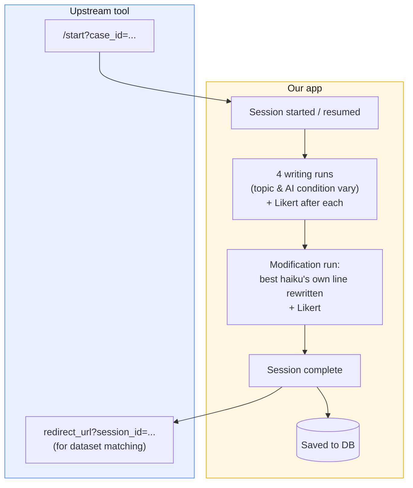

# OwnershipAshChat — Haiku Study

Phoenix/Ash application backing a research study in which participants write haikus
(see `AGENTS.md` for the full study concept). The participant walks a
[balanced randomized sequence](#randomization-balance) of writing runs at `/study`; entry is
normally via the upstream `case_id` link, but a one-click dev route starts a session locally.

## Table of contents

- [Flow overview](#flow-overview)
- [Setup](#setup)
- [LLM backend](#llm-backend)
- [Development](#development)
  - [Local debug session](#local-debug-session)
    - [Single-run harness](#single-run-harness)
- [Operations](#operations)
  - [Hosting on Uberspace](#hosting-on-uberspace)
  - [Building a release](#building-a-release)
  - [Notifications](#notifications)
    - [Daily stats report](#daily-stats-report)
    - [Randomization balance](#randomization-balance)
  - [Exporting study data](#exporting-study-data)
    - [Locally](#locally)
    - [On prod](#on-prod)
- [Learn more](#learn-more)

## Flow overview

Called from outside via `case_id`, runs the writing + Likert loop internally, then both
saves to the DB and redirects the participant back out (link carries the UUID). See
`AGENTS.md` for the full study concept.



## Setup

- `mix setup` — install deps, create + migrate the database
- `mix phx.server` (or `iex -S mix phx.server`) — start the server
- Visit [`localhost:4000`](http://localhost:4000)

For the production stack, see the [Phoenix deployment guides](https://phoenix.hexdocs.pm/deployment.html)
and [Operations](#operations) below.

## LLM backend

Config-driven (`OwnershipAshChat.LLM`, wired up in `config/runtime.exs` — see the comments
there for dev/test vs. prod and how to switch prod between OpenRouter and the real OpenAI
API). The matching API key goes in `bin/ownership_ash_chat.ini` (see its `.example`).

`:with_ai` (ping-pong) runs call the model, so they need a backend running.
`:without_ai` (solo writing) runs need **no** LLM.

## Development

Local, no-auth ways to walk the study flow end to end.

### Local debug session

The fastest way to walk the flow locally — no upstream link, no IEx. The dev routes are
only available with `dev_routes` enabled (the default in `dev`).

**1. Start the server**

```sh
mix phx.server
```

**2. One-click entry**

Open [`localhost:4000/dev/study/new`](http://localhost:4000/dev/study/new). This starts a
fresh session — drawing `topic_source_order` and seeding the four randomized `:writing`
runs — stashes the `session_id` in your session cookie, and drops you on `/study` at Run 1.

Walk each run: add your lines (ping-pong with the AI for `:with_ai` runs — the AI opens
with line 1 in `:assigned` runs, and writes line 2 in `:free` runs where your first line
sets the topic implicitly; `:assigned` runs display the fixed topic "Jahreszeiten"). Once
the haiku is complete, submit the questionnaire and click **Weiter** to advance.

After all four writing runs:

1. A transition card ("Schreibphase abgeschlossen") appears — click **Weiter**.
2. The app picks the best-scoring run (highest Likert average; random tie-break shows a
   flash), draws a modification variant (one word / one line / two lines), and calls the LLM
   to produce the modified haiku.
3. Rate the modification with the questionnaire, then click **Weiter**.
4. The end screen shows the **session UUID** to copy back into the upstream study tool.

Reloading mid-flow resumes at the current run without triggering a second LLM call.

> `:without_ai` runs need no LLM. `:with_ai` runs call the model for line 2, so they need a
> backend running (see [LLM backend](#llm-backend)).

#### Single-run harness

To drive one run in isolation by id, use
[`/dev/study/run/:run_id`](http://localhost:4000/dev/study/run). Create a run in IEx
(`iex -S mix`):

```elixir
s = OwnershipAshChat.Study.start_session!(%{case_id: "local-#{System.unique_integer([:positive])}"})
r = hd(OwnershipAshChat.Study.get_session!(s.id, load: [:runs]).runs)
"http://localhost:4000/dev/study/run/#{r.id}"
```

Other dev tooling: LiveDashboard at `/dev/dashboard`, mailbox preview at `/dev/mailbox`.

## Operations

Deploying, monitoring, and pulling data from the running app.

### Hosting on [Uberspace](https://uberspace.de)

Deployment is rsync + build-on-server: the project is synced to the Uberspace
account, deps/assets are built there, a release is cut, migrations run, and the
app is (re)started under [supervisord](https://manual.uberspace.de/daemons-supervisord/).

**One-time setup**

1. Copy `.envrc.private.example` → `.envrc.private` and set `UBERSPACE_USER` /
   `UBERSPACE_SERVER` (then `direnv allow`).
2. Copy `bin/ownership_ash_chat.ini.example` → `bin/ownership_ash_chat.ini` and fill in
   `USER`, `PHX_HOST`, `DATABASE_PATH`, the two secrets (`mix phx.gen.secret` for
   `SECRET_KEY_BASE` and `TOKEN_SIGNING_SECRET`), and the API key matching whichever LLM
   backend option is active in `config/runtime.exs` — `OPENROUTER_API_KEY` for Option A or
   `OPENAI_API_KEY` for Option B (see [LLM backend](#llm-backend)). This file is
   gitignored and synced to `~/etc/services.d/` by the deploy script. It is the **single
   source of truth** for prod env: `bin/release.sh` parses its `environment=` block for
   the migration step, so there is no separate `.env` file.

**Deploy**

```bash
./bin/deploy.sh
```

> [!TIP]
> You can also deploy without building assets — e.g. when you still have them locally: `./bin/deploy.sh --skip-assets`

This runs, over SSH: `bin/install.sh` (deps + assets), `bin/release.sh` (`mix release`,
then migrations via the release's `bin/migrate`), and `bin/restart_service.sh`
(`supervisorctl` reread/update/restart).

After the first deploy, [open a web backend on Uberspace](https://manual.uberspace.de/web-backends/#specific-path)
pointing at the `PORT` from `ownership_ash_chat.ini` (default `4001`).

**Serving under a subpath.** To run the app under a path prefix (e.g.
`https://USER.uber.space/ownership-survey` instead of the domain root), set that
path on the web backend with `--remove-prefix` (the prefix is stripped before
the request reaches the app) and set `URL_PATH` in `ownership_ash_chat.ini` to
the same value so Phoenix generates prefixed URLs:

```bash
uberspace web backend set /ownership-survey --http --port 4001 --remove-prefix
```

`URL_PATH` defaults to `/` (domain root) when unset. The upstream tool's entry
link then becomes
`https://USER.uber.space/ownership-survey/start?case_id=%caseToken%&case_number=%case%`.

> **Database:** prod uses SQLite (AshSqlite). `DATABASE_PATH` points at the prod `.db`
> file; exqlite links uberspace's system SQLite at build time (see `bin/install.sh`).

### Building a release

`mix release` produces `_build/prod/rel/ownership_ash_chat`, with `bin/server` (starts
the app with `PHX_SERVER=true`) and `bin/migrate` (runs `OwnershipAshChat.Release.migrate`)
from `rel/overlays/bin/`. If you build the release on a different machine than the target,
the build host must match the server's OS/architecture (see the
[Phoenix releases guide](https://hexdocs.pm/phoenix/releases.html)).

### Notifications

A small, pluggable notification layer (`OwnershipAshChat.Notifications`, a
[`knigge`](https://hex.pm/packages/ex_knigge) facade) pings an external channel on key
events. The backend is chosen at runtime by env var; **Telegram** is the only backend so
far. It's **best-effort** — a failed/misconfigured send is logged and swallowed, never
blocking or breaking the study flow.

**Events:** app started · app stopping (graceful shutdown) · session started (with the drawn
condition sequence and why it was drawn) · session completed (with the modification variant) ·
AI generation failed (LLM error during ping-pong) · daily stats report.

**Enable (Telegram):** set on the host (for prod, in `bin/ownership_ash_chat.ini`)

```sh
NOTIFICATION_PROVIDER=TELEGRAM
NOTIFICATION_PROVIDER_TELEGRAM_BOT_TOKEN=123456:ABC…     # from @BotFather
NOTIFICATION_PROVIDER_TELEGRAM_CHAT_ID=-1001234567890    # target chat/channel id
```

**Getting the two Telegram values:**

1. **Bot token** — DM [@BotFather](https://t.me/BotFather), send `/newbot`, follow the
   prompts; it replies with the token (`123456:ABC…`).
2. **Chat id** — add the bot to the target chat/channel (as admin for a channel), post
   any message there, then open
   `https://api.telegram.org/bot<TOKEN>/getUpdates` and read `result[].chat.id` (channels
   are negative, like `-100…`). For a 1:1 DM, message the bot instead and use your own
   `chat.id`.

Unset `NOTIFICATION_PROVIDER` (the default) selects the `Disabled` no-op backend, so
dev/test stay silent and need no secrets. Tests pin a forwarding backend
(`Notifications.TestBackend`) via `config/test.exs`.

#### Daily stats report

Once a day — **and once every time the app starts** (heading
`📊 Study stats at startup`, same body) — the bot posts the aggregate study statistics,
the same numbers `bin/export.sh stats` downloads (`OwnershipAshChat.Study.Stats`):

```
📊 Daily study stats — 2026-07-27

Sessions: 42 (28 completed, 13 in progress, 1 aborted)
Duration: median 18m 42s (min 9m 3s, max 1h 4m 9s, over 28 finished)

Randomization
topic first: assigned 21 / free 21
ai_mode first: block 1 with_ai 20 / without_ai 22 · block 2 with_ai 23 / without_ai 19
modifications: one word 13 / whole line 15
```

Labels are bold in the chat: messages are sent with Telegram's `parse_mode: "MarkdownV2"`.

#### Randomization balance

Conditions are **not** assigned by an independent coin flip per participant — that drifts
badly at this study's sample size (14 sessions once produced a 3 / 11 split on the
modification variant). Each assignment instead takes the **least-used** cell so far and only
falls back to chance on a tie:

- **Writing sequence** — balanced over all 8 valid orders as a whole
  (`{first topic_source, leading ai_mode of block 1, of block 2}`), which keeps the three
  splits above balanced too.
- **Modification variant** — balanced over `one word` / `whole line`.
- Counters come from the database (aborted sessions excluded), so this works on a fresh
  install *and* on a running study: an existing imbalance is actively caught up, without a
  migration or a config switch.

Operationally that means the `Randomization` / `modifications` lines above should keep
converging on 50/50 as sessions come in. A persistent lopsided split is a **signal**, not
noise — check whether many sessions are being abandoned (an abandoned session still consumed
its cell until it is marked `:aborted`).

The "session started" message names the drawn combination and why it was drawn ("the only one
of the 8 with 0 draws so far — forced"); "session completed" does the same for the variant. So
the chat log doubles as an audit trail of the assignment for every participant.

**On by default in prod** at **09:30 server-local time** (plus the report on start), off in
dev/test — `STATS_REPORT=0` disables both. Override on the host
(`bin/ownership_ash_chat.ini`):

```sh
STATS_REPORT=0          # turn the report off (1/true/yes/on turn it on)
STATS_REPORT_AT=07:15   # local time of day ("07:15" or "07:15:00")
```

No timezone database is bundled — the time follows the **server's** timezone (Uberspace:
`Europe/Berlin`). Implemented as a plain `Process.send_after/3` timer
(`OwnershipAshChat.Notifications.DailyReport`), so no scheduler dependency; to send one
immediately, call `OwnershipAshChat.Notifications.DailyReport.deliver_now()`.

**Add a provider:** implement the `OwnershipAshChat.Notifications` behaviour
(`deliver/1`) in a new backend module and add a `NOTIFICATION_PROVIDER` case in
`config/runtime.exs`. Per-provider credentials follow the
`NOTIFICATION_PROVIDER_<NAME>_*` naming.

### Exporting study data

Sessions are stored relationally; JSON is an on-demand export artifact.

#### Locally

The `study.export` Mix task (dev only — Mix is not in a release):

```sh
mix study.export <session_id>              # one session, to stdout
mix study.export --all                     # every session
mix study.export --all --status completed  # filter by status
mix study.export --all -o sessions.json    # write to a file
mix study.export --stats                   # aggregate statistics instead of raw data
```

Or from IEx (`iex -S mix`), the same code interfaces the task uses:

```elixir
# one session
OwnershipAshChat.Study.export_session!("<session_id>")
|> OwnershipAshChat.Study.Export.to_json!()

# all (optionally filtered)
OwnershipAshChat.Study.list_sessions_for_export!(%{status: :completed})
|> OwnershipAshChat.Study.Export.to_json!()

# aggregate statistics (counts, median duration, randomization balance)
OwnershipAshChat.Study.Stats.collect!()
```

#### On prod

Run `bin/export.sh` **from the client** (like `bin/deploy.sh`; needs `UBERSPACE_USER` /
`UBERSPACE_SERVER`). It builds the JSON on the server, then rsyncs it down to the local
path you give:

```sh
./bin/export.sh                              # all -> ./study_export_all.json
./bin/export.sh completed                    # completed -> ./study_export_completed.json
./bin/export.sh completed ~/Desktop/x.json   # completed -> given local path
./bin/export.sh stats                        # statistics -> ./study_export_stats.json
```

The `stats` selector produces the aggregate statistics JSON
(`OwnershipAshChat.Study.Stats`) instead of session data: session counts per status,
submitted questionnaires per run kind, median/min/max session duration, and the
randomization balance (which `topic_source` block came first, which `ai_mode` came first
inside each block). Same numbers as the daily notification — and the same counters the
assignment balances against, see [Randomization balance](#randomization-balance).

Mix tasks don't ship in a release, so the server side (`bin/export_remote.sh`, invoked
over SSH) loads the prod env from the supervisord service file and calls
`OwnershipAshChat.Release.export/2`. That starts the repo on its own — no dependency on
the running app or Erlang distribution (`remote`/`rpc` need a cookie + epmd, which this
deploy doesn't set up).

## Learn more

- Study concept & data model: `AGENTS.md`
- Phoenix: https://www.phoenixframework.org/ · https://phoenix.hexdocs.pm
- Ash: https://ash-hq.org · https://hexdocs.pm/ash
